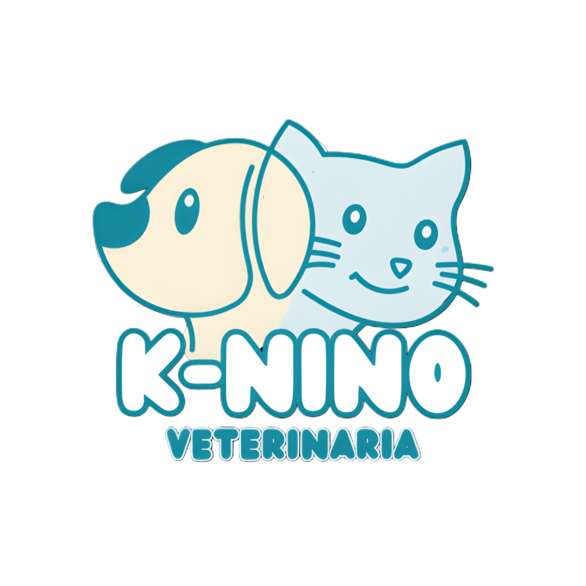

<div align="center">
  

  <h1>K nino</h1>

  <p>Sistema de procesamiento de transacciones</p>
  <a href="" target="_blank">Live Preview</a>
  <span>&nbsp;•&nbsp;</span>
  <a href="#getting-started">Getting Started</a>
</div>

<div align="center">
  
  
  
  
  
  
  
</div>

# 📝 Resumen

## Características

- 🔒 Autenticación segura con Google mediante roles
- CRUD para clientes, mascotas, servicios y empleados
- Subida de imágenes a Cloudinary
- ⚡ Interfaz rápida y responsive con Tailwind CSS

# 🛠️ Tecnologías

- [**Laravel**](https://laravel.com/) - El framework PHP para artesanos web. Sintaxis elegante y expresiva para desarrollo rápido.
- [**PHP**](https://www.php.net/) - Un lenguaje de scripting de propósito general, especialmente adecuado para desarrollo web.
- [**PostgreSQL**](https://www.postgresql.org/) - Sistema de gestión de bases de datos relacionales.
- [**Tailwind**](https://tailwindcss.com/) - Un framework CSS utility-first para construir diseños rápidamente.
- **Eloquent** – ORM de Laravel para acceso a datos de forma elegante.
- **JWT** – Autenticación basada en JSON Web Tokens.
- **Bun** – Runtime y gestor de paquetes JavaScript rápido.
- [**Tabler Icons**](https://tabler.io/) - Colección de iconos usada.

# 🎨 Vista previa

¿Curioso? Explora el sitio en vivo: <http://localhost:5173/>

# 🚀 Cómo ejecutar el proyecto localmente

Configura el proyecto localmente en unos pocos pasos:

### 1. Clona el repositorio

```bash
git clone https://github.com/LizandroBackEnd/knino.git

cd knino
```

### 2. Instala dependencias

> _Usamos [composer](https://getcomposer.org/) para las instalaciones de paquetes en Laravel

```bash
composer install
```
> [!IMPORTANT]
> Necesitas tener instalado [nodejs](https://getcomposer.org/) para poder hacer uso de bun
> Despues de haber instalado nodejs se debe de instalar [bun]()
> Por ultimo ejecutas: 

```bash
bun i
```

### 3. Configura las variables de entorno

Copia la plantilla y completa las secret keys:

> [!IMPORTANT]
> Necesitas credenciales de jwt
> para ejecutar este proyecto

```bash
cp .env.template .env
```

Para poder generar la secret key para jwt usa el siguiente comando:
```bash
php artisan jwt:secret
```


> [!WARNING]
> Verifica si tus credenciales ya existen

### 4. Inicia la base de datos

> [!NOTE]
> Docker es requerido para configurar la base de datos localmente.

```bash
docker compose up -d
```

### 5. Ejecuta las migraciones
Antes de hacer funcionar el proyecto es necesario ejecutar las migraciones y esto lo hacemos con:


### 6. Inicia el servidor de desarrollo
```bash
php artisan:migrations
```

```bash
php artisan serve
```

### Posibles errores:

1. Windows

2. Linux  
